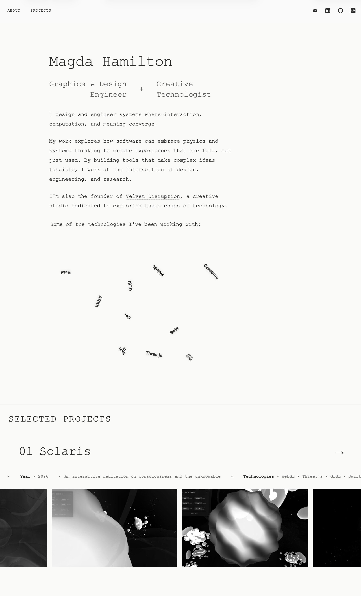

# Magda Hamilton - Portfolio Website

A minimalist portfolio website showcasing iOS design engineering and creative technology work. Built with a focus on interaction design, physics-based animations, and clean typography.

## Overview

This portfolio explores the intersection of design and engineering through interactive experiences. The site features a physics-based technology stack visualization and project showcases with infinite scrolling media ribbons.

## Screenshots



## Features

### Interactive Physics Visualization
- Real-time particle system representing technology stack
- Mouse/touch interaction with attraction and repulsion forces
- Particle collision and boundary detection
- Technologies displayed: Swift, SwiftUI, Metal, Three.js, UIKit, Combine, CoreData, ARKit, SceneKit

### Project Showcase
- Infinite horizontal scrolling ribbons for project media
- Dual-track scrolling details with key project information
- Grayscale-to-color transitions on hover
- Responsive design for mobile and desktop

### Design System
- Monospace typography (Courier New)
- Minimal color palette (off-white background, dark charcoal text)
- Subtle animations and transitions
- Glassmorphism navigation with backdrop blur

## Technical Stack

- **Frontend**: Vanilla JavaScript, HTML5, CSS3
- **Animation**: Custom physics engine, CSS animations
- **Graphics**: SVG for icons and tech badges
- **Responsive**: Mobile-first approach with media queries

## File Structure

```
├── index.html          # Main portfolio page
├── styles.css          # Global styles and layout
├── physics.js          # Physics simulation and interactions
└── images/             # Project media assets
```

## Key Components

### Physics System (`physics.js`)
- Particle class with position, velocity, and mass
- Force-based interactions (mouse attraction/repulsion, particle-to-particle)
- Boundary collision with energy damping
- Rotation and visual effects

### Scrolling Ribbons
- Infinite loop effect using duplicated content tracks
- CSS animation with pause-on-hover
- Responsive sizing for different viewports
- Video and image support

### Navigation
- Fixed header with blur backdrop
- Smooth scroll navigation
- Contact icons (Email, LinkedIn, GitHub, Crunchbase)
- Responsive mobile menu

## Styling Philosophy

The design emphasizes:
- **Minimalism**: Clean layouts with ample whitespace
- **Typography**: Monospace fonts for technical aesthetic
- **Interaction**: Physics-based and scroll-based animations
- **Accessibility**: Semantic HTML, ARIA labels, keyboard navigation

## Browser Support

- Modern browsers with ES6+ support
- CSS Grid and Flexbox
- IntersectionObserver API
- RequestAnimationFrame for smooth animations

## Performance Considerations

- Efficient particle update loop using RAF
- CSS transforms for smooth animations
- Lazy video loading with autoplay
- Optimized event listeners with proper cleanup

## SEO & Metadata

- Structured data (JSON-LD) for person and organization
- Open Graph and Twitter Card meta tags
- Semantic HTML5 elements
- Canonical URLs and proper meta descriptions

## Future Enhancements

- Additional project case studies
- Dark mode toggle
- WebGL shaders for advanced effects
- Enhanced mobile gestures

---

**Created by Magda Hamilton**  
iOS Design Engineer + Creative Technologist  
[velvetdisruption.com](https://velvetdisruption.com)
